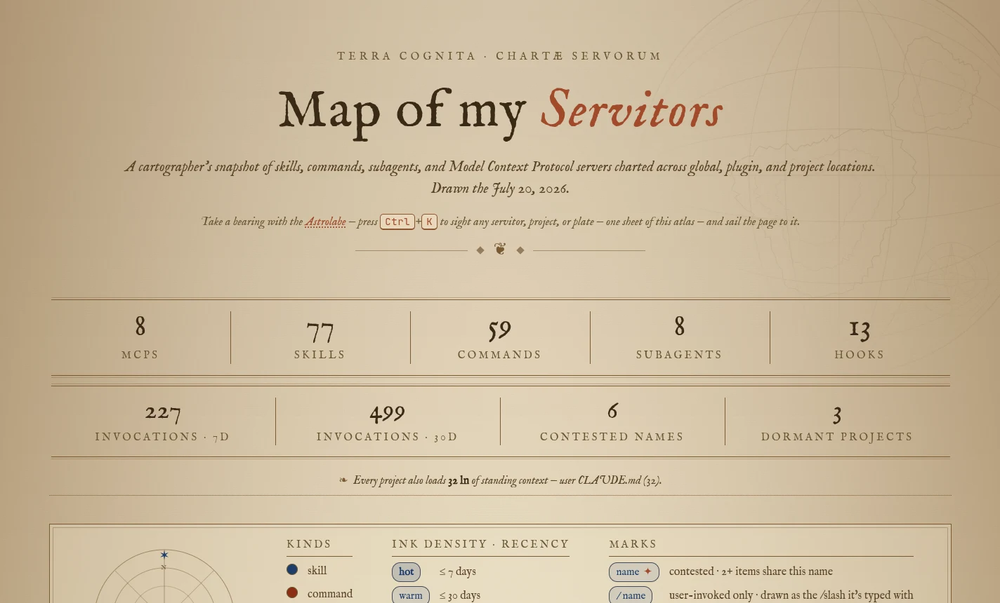
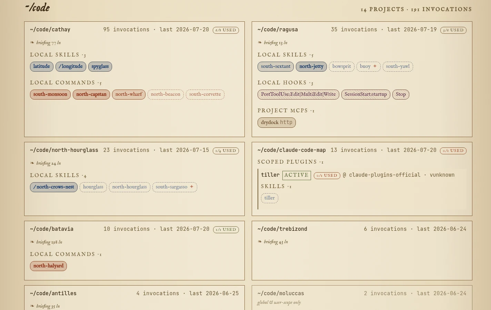
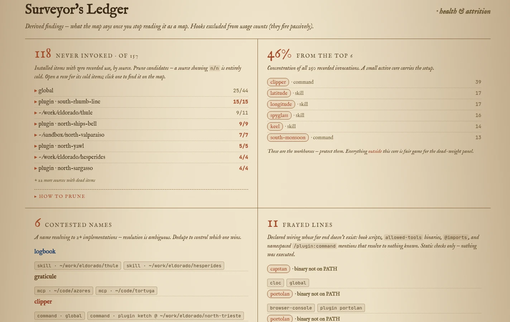

# claude-code-map

An interactive **cartographer's atlas** of your Claude Code setup. It scans `~/.claude` and renders every skill, slash command, subagent, MCP server, and hook as an antique map — colour-coded by kind, inked by how recently you've used each one.



## What it shows

- **Inventory** of all your servitors (skills, commands, subagents, MCPs, hooks) across global, plugin, and project scopes.
- **Heat** — recency tiers (`hot` ≤7d, `warm` ≤30d, `cool` ≤90d, `stale`, `none`) derived from your transcript history, rendered as ink density.
- **Contested names** — invocation tokens that resolve to two or more implementations (e.g. a global skill `verify` and a plugin command `/verify`).
- **Frayed lines** — declared wiring whose far end doesn't exist: hook scripts that are missing, `allowed-tools` binaries not on PATH, unresolved `@imports`, and `/plugin:command` mentions that resolve to nothing known.
- **Invocation marks** — user-invoked only drawn as `/name` (`disable-model-invocation: true`), ✳ model-invoked only (`user-invocable: false`), scraped from skill/command frontmatter.
- **Regional plates** — one map plate per workspace region, with a project card per project sorted by activity.
- **The Astrolabe** (<kbd>Ctrl</kbd>+<kbd>K</kbd>) — a sighting instrument: type to fuzzy-find any servitor, project, region or plate; <kbd>Enter</kbd> sails the page to it and flashes the target.

### Regional plates

Each region of your filesystem gets its own plate. Every project card lists its local skills, commands, hooks, and MCPs, inked by heat (names below are fictitious):



### Surveyor's Ledger

Derived findings — what the map says once you stop reading it as a map: never-invoked servitors ranked by source (prune candidates), invocation concentration, contested names, and frayed lines (names below are fictitious):



## Usage

Requires Node ≥ 23.6 (uses native TypeScript execution).

```sh
# Serve the live atlas (rebuilds on each refresh)
node bin/cli.ts

# → http://127.0.0.1:7777/
```

Render once to a static HTML file:

```sh
node bin/cli.ts --out atlas.html
```

### Options

| Flag             | Default     | Description                     |
| ---------------- | ----------- | ------------------------------- |
| `-p, --port N`   | `7777`      | Server port                     |
| `--host HOST`    | `127.0.0.1` | Bind host                       |
| `-o, --out FILE` | —           | Render once to FILE (no server) |
| `-h, --help`     | —           | Show help                       |

## How it works

1. `src/collect.ts` walks `~/.claude` (config dirs, plugin installs, JSONL transcripts) and builds the inventory plus usage stats.
2. `src/render.ts` turns that into atlas HTML fragments.
3. `bin/cli.ts` either serves them over HTTP or writes a single self-contained page.

The atlas speaks in a cartographer's voice. Shared vocabulary (servitor, plate, heat, landmark, contested name, …) lives in [`GLOSSARY.md`](./GLOSSARY.md).
