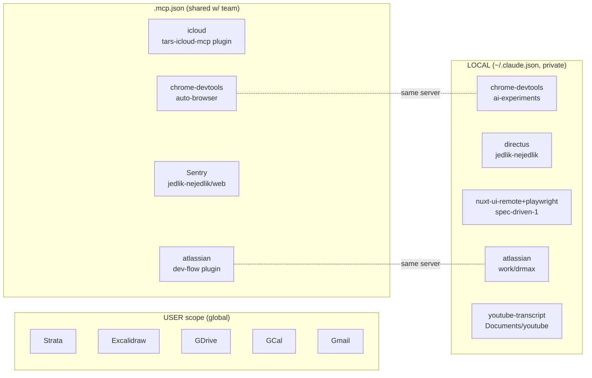

# MCP Usage Map

Snapshot of MCP server configuration across scopes on this machine.

## Scopes

Claude Code resolves MCP servers from three scopes:

1. **User scope (global)** — `~/.claude.json` `mcpServers` + claude.ai remote servers. Available in every session.
2. **Project scope** — `.mcp.json` at project root, checked into repo, shared with collaborators.
3. **Local scope** — `~/.claude.json` `projects.<path>.mcpServers`, per-project but private to this user.

## Inventory

### User scope

- `~/.claude.json` → `mcpServers`: **empty**
- claude.ai remote (always on): `Strata`, `Excalidraw`, `Google Drive`, `Google Calendar`, `Gmail`

### Project scope (`.mcp.json`)

| Path | Server |
|---|---|
| `~/.claude/marketplaces/product-claude-marketplace/plugins/tars-icloud-mcp/.mcp.json` | `icloud` |
| `~/code/auto-browser/.mcp.json` | `chrome-devtools` |
| `~/code/jedlik-nejedlik/web/.mcp.json` | `Sentry` |
| `~/code/claude-marketplace/plugins/dev-flow/.mcp.json` | `atlassian` |

### Local scope (`~/.claude.json` per-project)

| Path | Servers |
|---|---|
| `~/code/ai-experiments` | `chrome-devtools` |
| `~/code/jedlik-nejedlik` | `directus` |
| `~/sandbox/spec-driven-1` | `nuxt-ui-remote`, `playwright` |
| `~/work/drmax` | `atlassian` |
| `~/Documents/youtube` | `youtube-transcript` |

## Shared vs unique

- `chrome-devtools` — shared: `auto-browser` (project) + `ai-experiments` (local)
- `atlassian` — shared: `dev-flow` plugin (project) + `work/drmax` (local)
- claude.ai remote 5 — shared globally across all projects
- All other servers — unique to one location

## ASCII map

```
USER (~/.claude.json mcpServers)    →  [] empty
USER (claude.ai remote, always on)  →  Strata · Excalidraw · GDrive · GCal · Gmail
│
├── PROJECT .mcp.json (team-shared)
│   ├── plugins/tars-icloud-mcp      → icloud
│   ├── code/auto-browser            → chrome-devtools  ╲
│   ├── code/jedlik-nejedlik/web     → Sentry            ╲ overlap
│   └── plugins/dev-flow             → atlassian         ╱  with local
│                                                       ╱
└── LOCAL (~/.claude.json projects.*.mcpServers, user-private)
    ├── code/ai-experiments          → chrome-devtools  ←┘ (shared name)
    ├── code/jedlik-nejedlik         → directus
    ├── sandbox/spec-driven-1        → nuxt-ui-remote, playwright
    ├── work/drmax                   → atlassian        ←┘ (shared name)
    └── Documents/youtube            → youtube-transcript
```

## Mermaid



## Source commands

```bash
fd -H -t f '\.mcp\.json$' /home/lukas --max-depth 6
jq '.mcpServers | keys' ~/.claude.json
jq '.projects | to_entries[] | select(.value.mcpServers != null and (.value.mcpServers | length > 0)) | {path: .key, servers: (.value.mcpServers | keys)}' ~/.claude.json
claude mcp list
```
